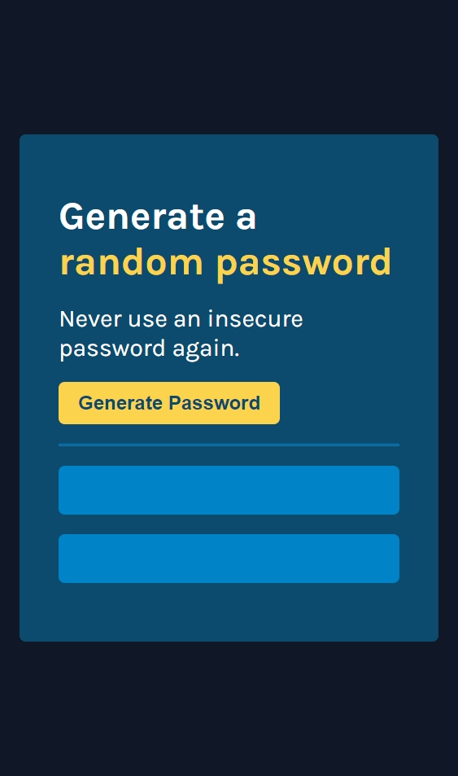
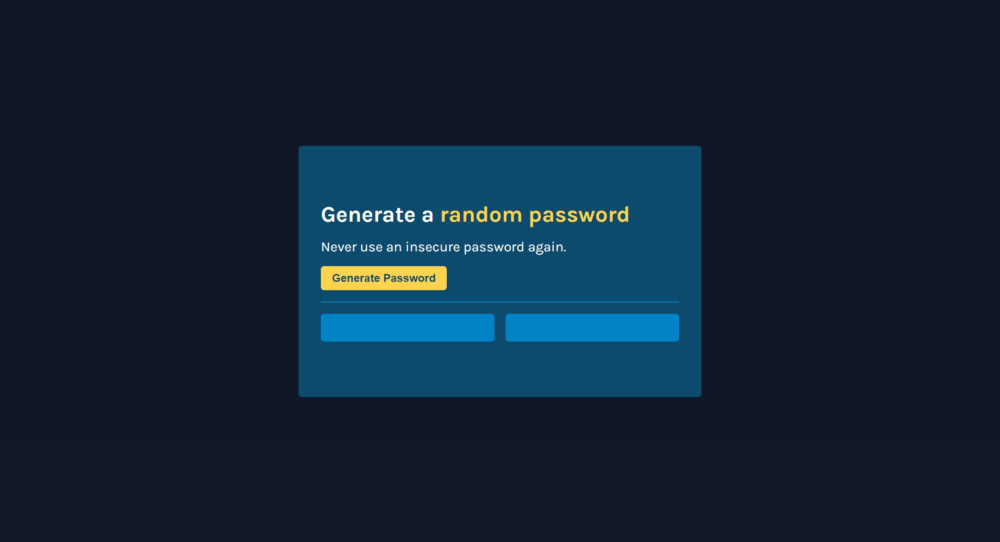

# Scrimba - Solo Project - Password Generator

This is a solution to [Scrimba - Solo Project - Password Generator](https://scrimba.com/learn/frontend) found in Module 3 for The Frontend Developer Career Path from Scrimba. 

## Table of contents

- [Scrimba - Solo Project - Password Generator](#scrimba---solo-project---password-generator)
  - [Table of contents](#table-of-contents)
  - [Overview](#overview)
    - [The challenge](#the-challenge)
    - [Screenshot](#screenshot)
  - [My process](#my-process)
    - [Built with](#built-with)
    - [What I learned](#what-i-learned)
    - [Continued development](#continued-development)
  - [Author](#author)

## Overview

### The challenge

Requirements
- Build a password generator that generates two random passwords when the user clicks the button.
- Each password should be 15 characters long

Stretch goals
- Ability to set password length
- Add "copy-on-click"
- Toggle "symbols" and "numbers" on/off

### Screenshot

- 
- 

## My process

### Built with

- Semantic HTML5 markup
- CSS custom properties
- Vanilla JavaScript
- Mobile-first workflow

### What I learned

I learned that even though I was nervous approaching this solo project, I was prepared despite my misgivings. 

### Continued development

I want to, in the future, tackle the stretch goals as I learn more and have more skills underneath my belt. I also want to change the color palette.

## Author

- Website - [Evalia Varona](https://www.evaliavarona.com)
- Hashnode - [@evavarona](https://evaliavarona.hashnode.dev)